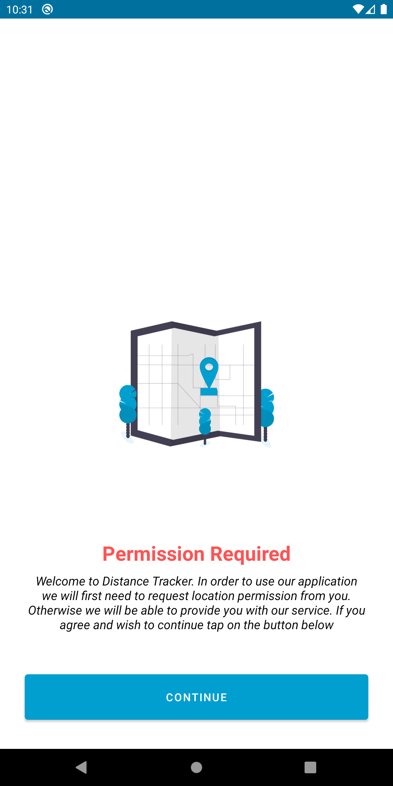
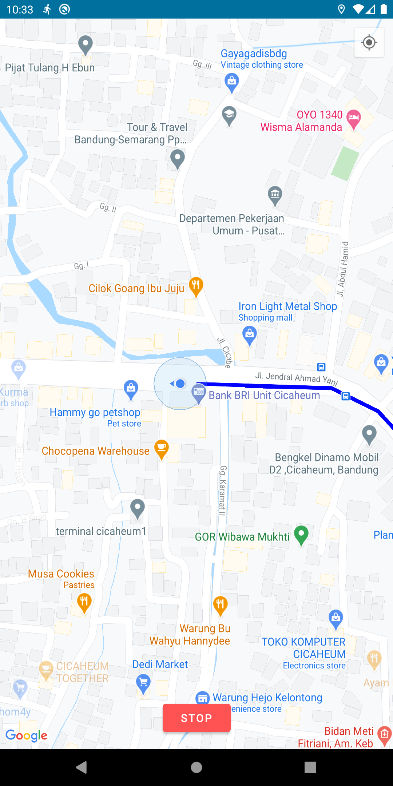
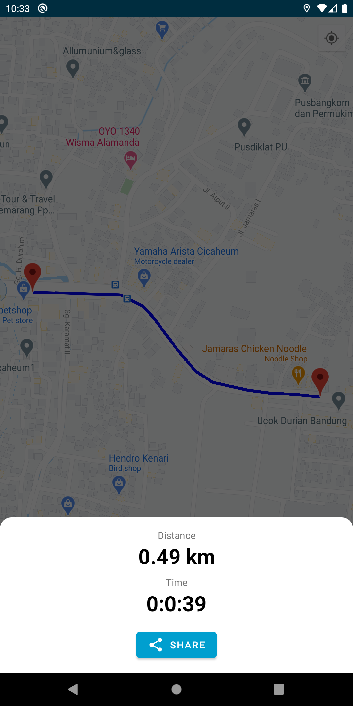

# Distance Tracker Application
  

## Demo    
<h3 align="center"> Main Screen </h3>

    
    
    

## Feature :
- Using Google Maps API
- Google Maps SDK for Android
- Using Dagger-Hilt as depepndecy injection
- Using View Binding and Data Binding
- Using Maps SDK Utility Library
- Using Foreground Service
- Using ViewBinding & DataBinding
- Get Users Last Known Location
- Push Notification Updates
- Draw Polylines
- Calculate the Distance on the Map
- Locate your Device with One Click
